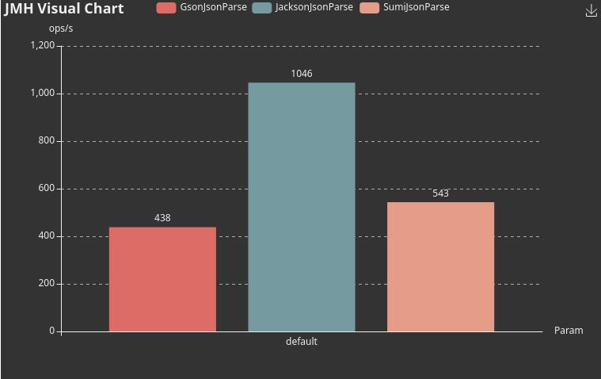

# Sumi

Sumi is a compile-time json (de)serializer, a trade-off between high performance and library size.

It is lightweight, you can feel free to embed it into your application without worrying it is bigger than your all
business codes.

Status: Under Development, PoC.

# Feature

- Java 9 Module System Support
- Lightweight (21Kb for `sumi-core`)
- Fast
- Zero dependencies

# Performance


[Json for benchmark (~1w line)](./benchmark/test.json)
```
CPU: AMD Ryzen 7 4800U with Radeon Graphics (16) @ 1.800GHz
Memory: 15357MiB in total
# JMH version: 1.29
# VM version: JDK 17.0.2, OpenJDK 64-Bit Server VM, 17.0.2+8-LTS
# VM invoker: /home/icybear/.jdks/azul-17.0.2/bin/java
# VM options: -Dfile.encoding=UTF-8 -Djava.io.tmpdir=/home/icybear/IdeaProjects/sumi/benchmark/build/tmp/jmh -Duser.country=US -Duser.language=en -Duser.variant
# Blackhole mode: full + dont-inline hint
# Warmup: 4 iterations, 10 s each
# Measurement: 3 iterations, 10 s each
# Timeout: 10 min per iteration
```

# To-do

- [x] Json Parsing
- [ ] Compile-time serialization
- [ ] Runtime bytecode generation
- [ ] More Json Features